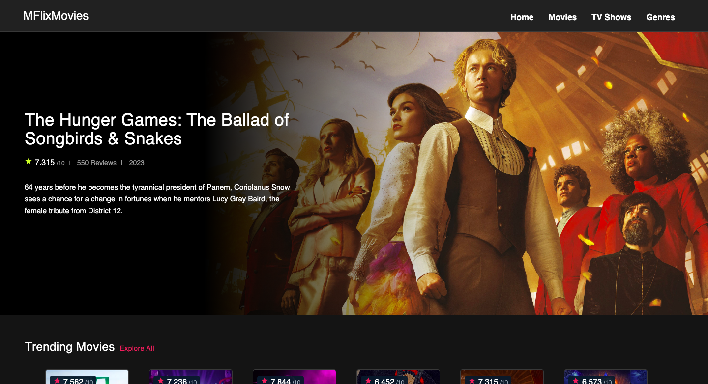

# Angular MoviesExpo

This project was generated with version 16.2.12

## Development server

Run `ng serve` for a dev server. Navigate to `http://localhost:4200/`. The app will automatically reload if you change any of the source files.

## Angular  MFlixMovies & TV Shows was generated with:

- Angular CLI version 16.2.12
- Angular 16.2.12
- Angular Material 13.0.0
- Rxjs 7.5.0
- PrimeNg Library 8.0 -> https://www.primefaces.org/primeng/#/
- The Movie DB get Your own api key -> https://www.themoviedb.org


## Installation

```bash
git clone https://github.com/Matoskipo/Angular-movie-app
cd angular-movie-app
npm install
ng serve and go to http://localhost:4200/
```

<p align="center">
    <a>
        
    </a>
</p>


